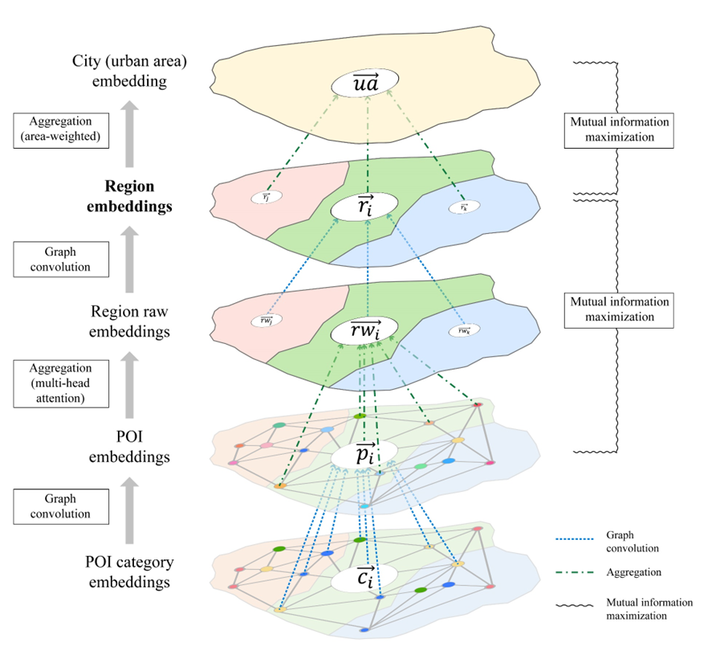
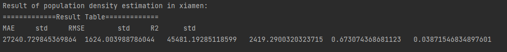

# Learning region representations with POIs and hierarchical graph infomax

This project is linked to a paper published in ISPRS Journal of Photogrammetry and Remote Sensing: [Learning urban region representations with POIs and hierarchical graph infomax](https://doi.org/10.1016/j.isprsjprs.2022.11.021)
.
In this study, we propose the hierarchical graph infomax (HGI) approach for learning urban region representations (vector embeddings) with points-of-interest (POIs) in a fully unsupervised manner, which can be used in various downstream tasks. 

## Quick start
With this repository, you can 
- learn the region representations using the pre-constructed sub-sampled dataset in Shenzhen, China;
- use the learned region embeddings for downstream tasks.

## Environment (here we only report the versions we used)
- Python 3.8.13
- PyTorch 1.12.1
- Pytorch_geometric 2.1.0
- Scikit-learn 1.1.2
- Tdqm 4.61.4
- Pytorch_warmup 0.1.0

## Structure
There are two main scripts in this repository: `train.py` and `evaluation.py`.


## `train.py`
`train.py` is used to learn the region representations. You can specify the dataset by setting the `--city` argument. For example, to learn the region representations for Shenzhen or xiamen, you can run 

`python train.py --city shenzhen` 

The learned region representations will be saved in the `./Emb` folder. 

The arguments that can be specified in `train.py` are as follows:
- `--city`: the city name, e.g., "shenzhen". 
  - We provide a sample pre-processed dataset (subset of the dataset) in Shenzhen, and you could download the [data](https://figshare.com/articles/dataset/Sub-sampled_dataset_for_Shenzhen_HGI_region_embedding_example_dataset_/21836496) `shenzhen_data.pkl` and put it under the folder `Data`. After that, you can run `python train.py --city shenzhen` to learn the region representations for Shenzhen.
- `--dim`: the dimension of the learned region representations.
- `--alpha`: the hyperparameter to ba balance mutual information.
- `--attention_head`: number of attention heads in the aggregation function.
- `--lr`: the learning rate.
- `--max_norm`: the maximum norm of the gradient.
- `--gamma`: gamma in learning rate scheduler.
- `--warmup_period`: the warmup period, i.e., how many epochs for linear learning rate warmup.
- `--epoch`: the number of epochs.
- `--device`: the device to use, which can be `cpu` or `cuda` or `cuda:{}`.
- `--save_name`: the name of the saved region representations.'

In case you would like to construct your own dataset to learn region representations for other study areas, you need to construct a Data object in the `./Data` folder. The Data object should contain the following attributes:
- `x`: POI initial features, which can be POI category embeddings (can even be one-hot vectors) or POI embeddings learned by other methods.
- `edge_index`: the POI graph structure, which is a tensor of shape (2, E), where E is the number of edges.
- `edge_weight`: the edge weights.
- `region_id`: the region id of each POI.
- `region_area`: the area proportion of each region in its city.
- `coarse_region_similarity`: the coarse similarity of each region with all other regions. This is a (N, N) matrix, where N is the number of regions.
- `region_adjacency`: the adjacency matrix of regions. 


## `evaluation.py`
`evaluation.py` is used to evaluate the learned region representations. Currently it supports two study areas:
- `xiamen`: Xiamen Island, China
- `shenzhen`: Shenzhen, China
and three downstream tasks:
- `uf`: urban function inference (this repo contains mocked ground truth data, the real ground truth data can be requested from [here](http://geoscape.pku.edu.cn/en.html))
- `pd`: population density estimation
- `hp`: housing price estimation

For example, you could run 

`python evaluation.py --city xiamen --task pd` 

to evaluate the learned region representations for Xiamen Island on population density estimation. The results will be printed in console.


## Embeddings
The learned region representations for Xiamen Island and Shenzhen are available in the `./Emb` folder. You can load them by `torch.load()`.

## Notes
Some codes for the pooling from POIs to regions are borrowed from [Set Transformer's GitHub repository](https://github.com/juho-lee/set_transformer).

## Citation

If you use the code in this project, please cite the paper the ISPRS Journal.
```
@article{huang2023hgi,
  title={Learning urban region representations with POIs and hierarchical graph infomax},
  author={Huang, Weiming and Zhang, Daokun and Mai, Gengchen and Guo, Xu and Cui, Lizhen},
  journal={ISPRS Journal of Photogrammetry and Remote Sensing},
  volume={196},
  pages={134--145},
  year={2023}
}
```

## Contact
Weiming Huang (Nanyang Technological University)

Email: weiming.huang@ntu.edu.sg
